import { DiagramViewer } from '@/components/DiagramViewer'

# Embedding Diagrams in ADRs

Mermaid diagrams help visualize architecture decisions. This guide shows common patterns for ADR documentation.

## Supported Diagram Types

### Flowcharts

Show processes, workflows, or decision trees:

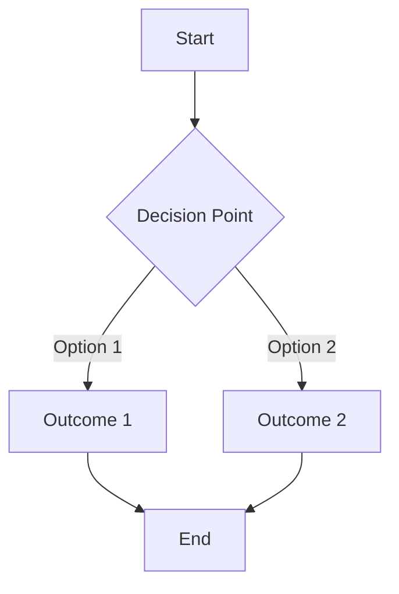

**Syntax:**

```
flowchart TD
    A[Start] --> B{Decision Point}
    B -->|Option 1| C[Outcome 1]
    B -->|Option 2| D[Outcome 2]
```

### Sequence Diagrams

Show interactions between components:

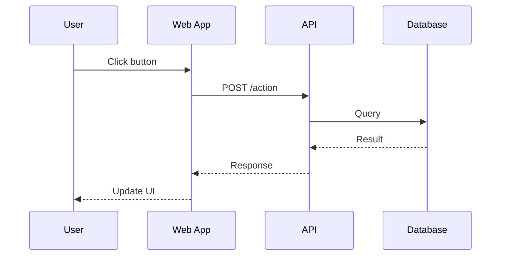

**Syntax:**

```
sequenceDiagram
    participant U as User
    participant W as Web App
    participant A as API

    U->>W: Click button
    W->>A: POST /action
    A-->>W: Response
```

### C4 Context Diagrams

Show system context and external actors:

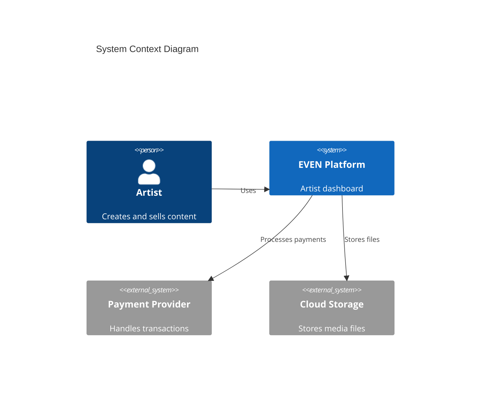

**Syntax:**

```
C4Context
    Person(id, "Label", "Description")
    System(id, "Label", "Description")
    System_Ext(id, "Label", "Description")
    Rel(from, to, "Description")
```

### C4 Container Diagrams

Show internal system structure:

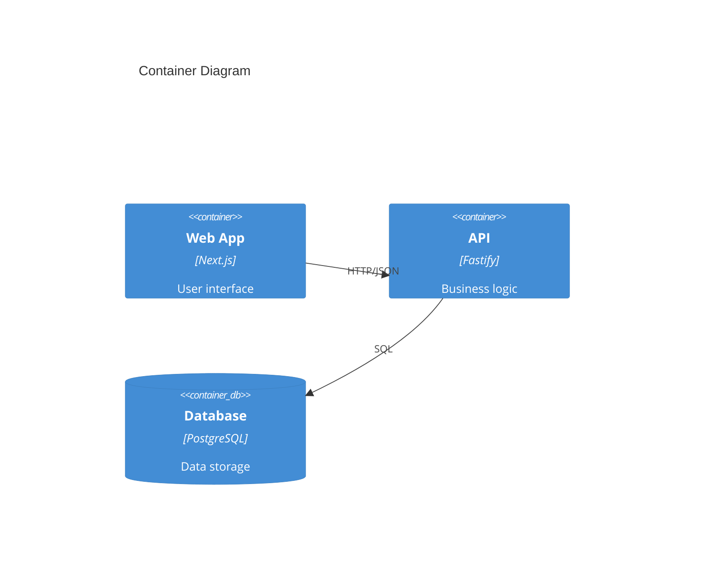

### State Diagrams

Show status transitions (great for ADR status workflow):

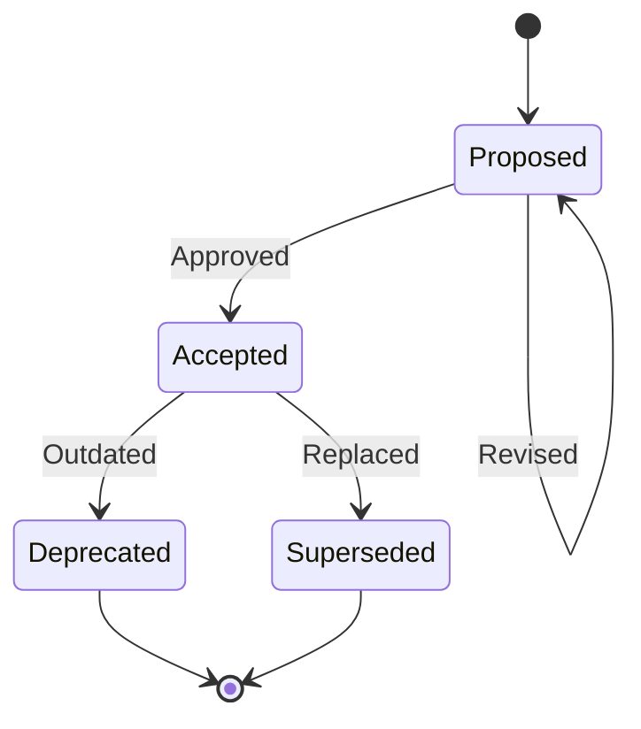

**Syntax:**

```
stateDiagram-v2
    [*] --> State1
    State1 --> State2 : Event
    State2 --> [*]
```

### Entity Relationship Diagrams

Show data models:

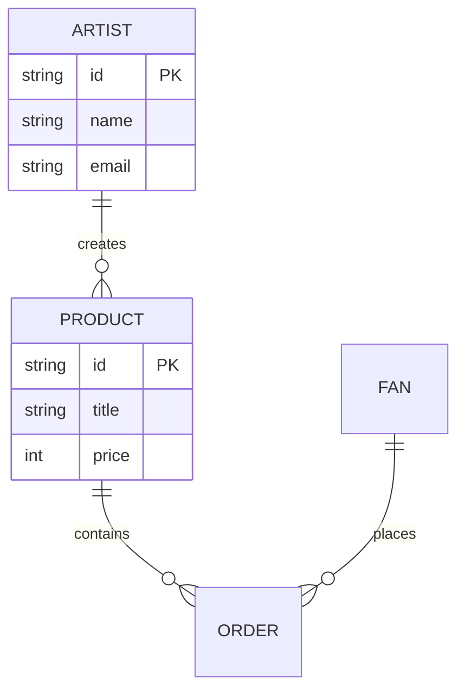

## Best Practices

### Keep Diagrams Simple

Aim for 5-10 elements max. Break complex diagrams into multiple simpler ones.

**Too Complex:**
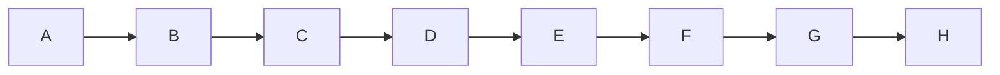

**Better - Split into sections:**
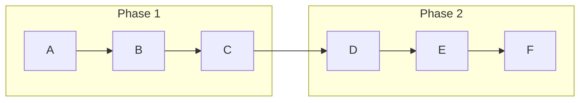

### Use Consistent Styling

Stick to these conventions:

- **Rectangles** `[text]` for processes/components
- **Diamonds** `{text}` for decisions
- **Rounded** `(text)` for start/end
- **Cylinders** `[(text)]` for databases

### Add Labels to Connections

Always label arrows to explain the relationship:

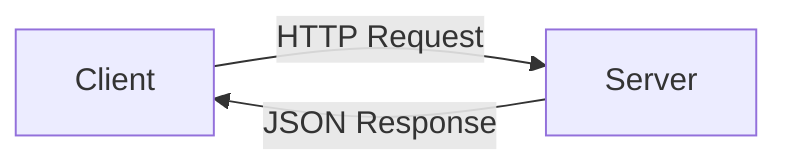

### Use Subgraphs for Grouping

Group related elements:

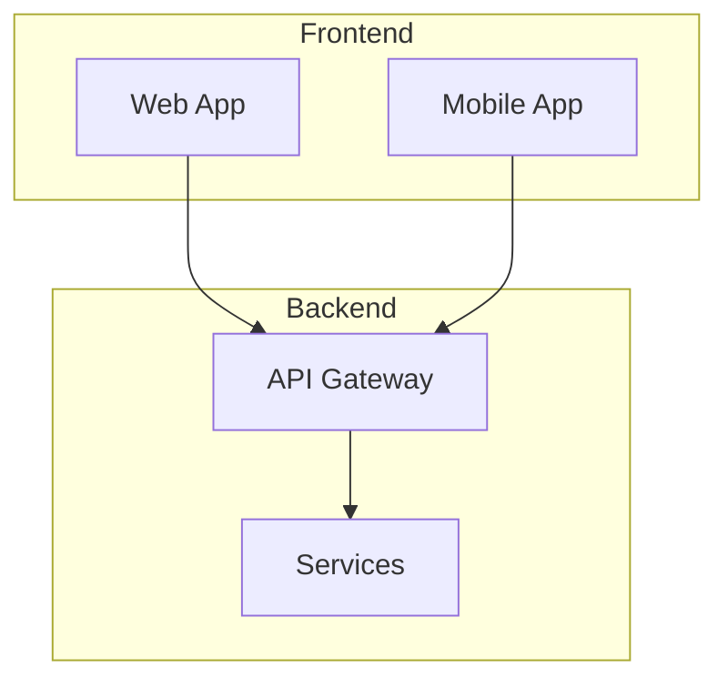

## Common ADR Diagram Patterns

### Option Comparison

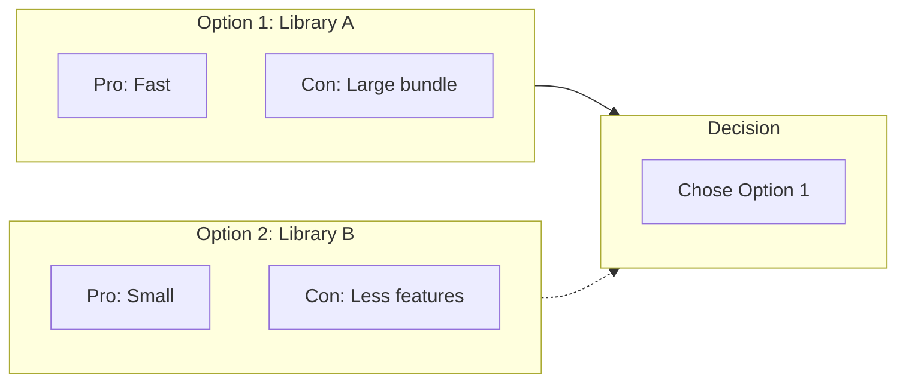

### Migration Path

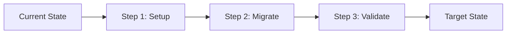

### Architecture Decision

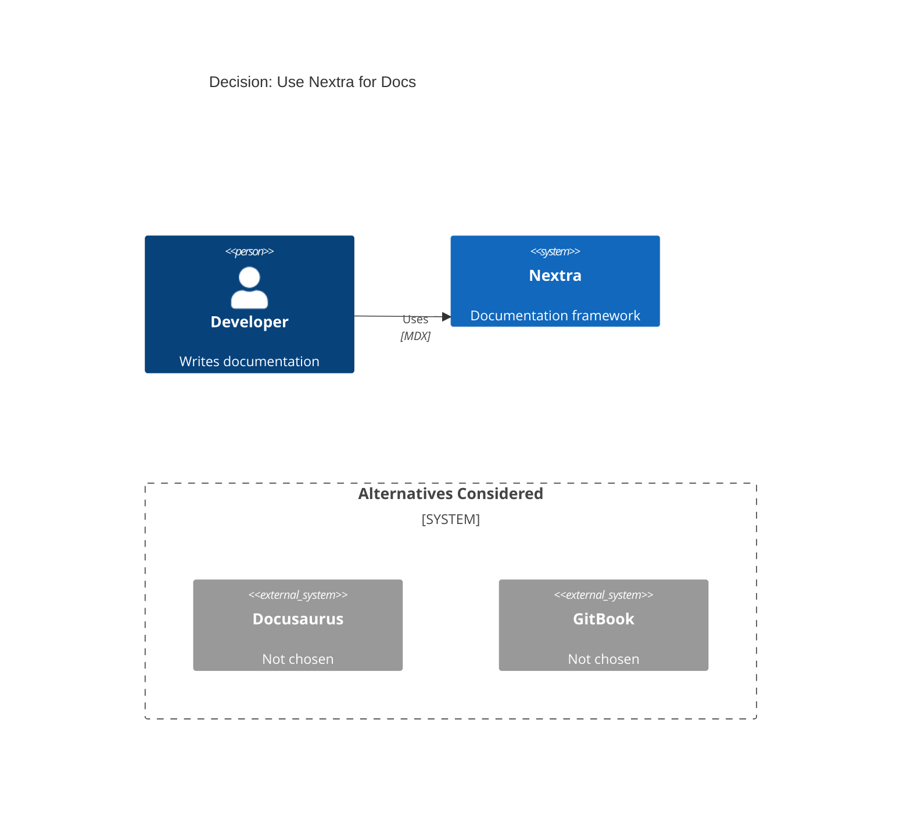

## Troubleshooting

### Diagram Not Rendering

1. Check syntax - use the [Mermaid Live Editor](https://mermaid.live)
2. Ensure code block uses `mermaid` language tag
3. Check for special characters that need escaping

### Layout Issues

- Use `TB` (top-bottom) or `LR` (left-right) for direction
- Add `%%{init: {'theme': 'dark'}}%%` for dark mode

## Related

- [ADR Index](/adr) - Browse all ADRs
- [How to Create ADR](/adr/how-to-create) - ADR creation guide
- [Architecture Diagrams](/architecture) - System diagrams
