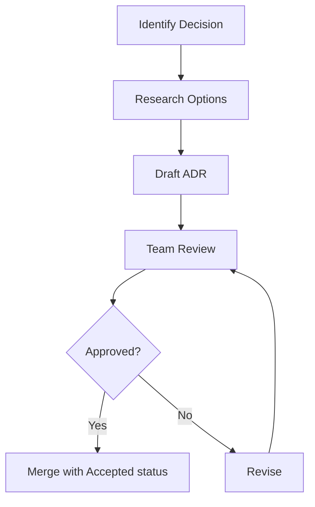

import { ADRStatusBadge } from '@/components/ADRStatusBadge'

# How to Create an ADR

This guide walks you through creating a new Architecture Decision Record (ADR) for the EVEN platform.

## When to Write an ADR

Write an ADR when:

- Making a significant technical decision
- Choosing between multiple viable options
- Changing or deprecating an existing approach
- Introducing new dependencies or patterns
- Decisions that will impact other developers

## Quick Start

1. Copy the template file
2. Fill in each section
3. Submit for review
4. Update status after approval

## Template

Download or copy the ADR template:

```markdown
---
title: "ADR-NNN: Decision Title"
description: Brief description of what was decided
status: proposed
date: YYYY-MM-DD
deciders: ["Name1", "Name2"]
---

# ADR-NNN: Decision Title

## Status

Proposed

## Context

Describe the issue motivating this decision, and any context that influences or constrains the decision.

## Decision

Describe the decision that was made, the approach taken, and why.

## Consequences

### Positive

- List positive outcomes

### Negative

- List negative outcomes or trade-offs

### Neutral

- List neutral outcomes

## Related ADRs

- Supersedes: ADR-XXX (if applicable)
- Related to: ADR-YYY, ADR-ZZZ
```

## Section Details

### Title

Use a clear, descriptive title that indicates what was decided:

**Good**: "Use Nextra for Documentation"
**Bad**: "Documentation Framework"

### Status

ADRs progress through these statuses:

<div className="flex gap-2 my-4 flex-wrap">
  <ADRStatusBadge status="proposed" />
  <ADRStatusBadge status="accepted" />
  <ADRStatusBadge status="deprecated" />
  <ADRStatusBadge status="superseded" />
</div>

See [Status Workflow](/adr/status-workflow) for details on when to use each status.

### Context

Explain:
- What problem are we solving?
- What constraints do we have?
- What options did we consider?
- Why is this decision needed now?

### Decision

State clearly:
- What we decided
- Why this option was chosen
- Key factors in the decision

### Consequences

Be honest about trade-offs:
- **Positive**: Benefits we gain
- **Negative**: Costs or limitations we accept
- **Neutral**: Changes that are neither good nor bad

## Adding Diagrams

ADRs can include Mermaid diagrams. See the [Diagram Guide](/adr/diagram-guide) for examples.



## File Naming

Name ADR files with sequential numbers:

```
apps/docs/src/pages/adr/
├── 001-use-nextra-for-docs.mdx
├── 002-use-mermaid-for-diagrams.mdx
├── 003-madr-format-for-adrs.mdx
└── 004-your-new-adr.mdx
```

## Review Process

1. **Create PR** with the new ADR file (status: `proposed`)
2. **Request Review** from relevant team members
3. **Discuss** in PR comments
4. **Iterate** based on feedback
5. **Merge** with status updated to `accepted`

## Tips

### Keep it Concise

ADRs should be readable in 5 minutes or less. Link to external docs for deep dives.

### Focus on "Why"

The most valuable part of an ADR is explaining *why* we made a decision, not just *what* we decided.

### Include Rejected Options

Briefly mention alternatives you considered and why they were rejected.

### Update, Don't Delete

If a decision changes, create a new ADR that supersedes the old one rather than editing history.

## Related Guides

- [ADR Index](/adr) - Browse all ADRs
- [Diagram Guide](/adr/diagram-guide) - Adding Mermaid diagrams
- [Status Workflow](/adr/status-workflow) - Understanding ADR statuses
