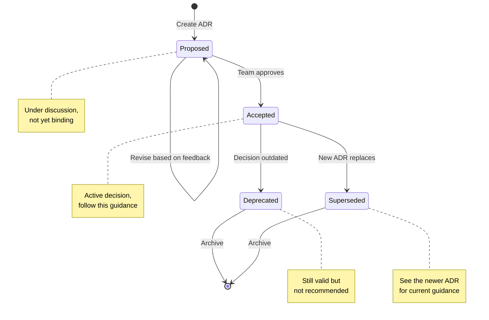

import { ADRStatusBadge } from '@/components/ADRStatusBadge'

# ADR Status Workflow

Architecture Decision Records (ADRs) follow a defined lifecycle with four statuses. This page explains when and how ADRs transition between statuses.

## Status Overview

<div className="grid gap-4 mt-6 mb-8">
  <div className="flex items-start gap-4 p-4 bg-zinc-900 rounded-lg border border-zinc-800">
    <ADRStatusBadge status="proposed" />
    <div>
      <h4 className="font-semibold text-zinc-200">Proposed</h4>
      <p className="text-sm text-zinc-400 mt-1">Initial state for new ADRs under discussion</p>
    </div>
  </div>

  <div className="flex items-start gap-4 p-4 bg-zinc-900 rounded-lg border border-zinc-800">
    <ADRStatusBadge status="accepted" />
    <div>
      <h4 className="font-semibold text-zinc-200">Accepted</h4>
      <p className="text-sm text-zinc-400 mt-1">Decision approved and actively followed</p>
    </div>
  </div>

  <div className="flex items-start gap-4 p-4 bg-zinc-900 rounded-lg border border-zinc-800">
    <ADRStatusBadge status="deprecated" />
    <div>
      <h4 className="font-semibold text-zinc-200">Deprecated</h4>
      <p className="text-sm text-zinc-400 mt-1">Decision no longer recommended but not replaced</p>
    </div>
  </div>

  <div className="flex items-start gap-4 p-4 bg-zinc-900 rounded-lg border border-zinc-800">
    <ADRStatusBadge status="superseded" />
    <div>
      <h4 className="font-semibold text-zinc-200">Superseded</h4>
      <p className="text-sm text-zinc-400 mt-1">Decision replaced by a newer ADR</p>
    </div>
  </div>
</div>

## Status Transitions



## Status Definitions

### Proposed

<ADRStatusBadge status="proposed" />

- **Meaning**: A decision is being considered but not yet approved
- **When to use**: Creating a new ADR for team review
- **Actions allowed**: Edit, discuss, revise
- **Next states**: Accepted (approved) or stays Proposed (needs revision)

**Example scenario**: You want to introduce a new testing framework. Create an ADR with "proposed" status, gather team feedback, and revise as needed.

### Accepted

<ADRStatusBadge status="accepted" />

- **Meaning**: The decision has been approved and should be followed
- **When to use**: After team consensus and approval
- **Actions allowed**: Follow the decision, reference in code reviews
- **Next states**: Deprecated (outdated) or Superseded (replaced)

**Example scenario**: The team agrees on the testing framework. Update status to "accepted" - this is now the official approach.

### Deprecated

<ADRStatusBadge status="deprecated" />

- **Meaning**: The decision is no longer recommended but hasn't been formally replaced
- **When to use**: When circumstances change but no clear replacement exists
- **Actions allowed**: Reference for historical context, avoid for new work
- **Next states**: Terminal (archive)

**Example scenario**: A library you chose is no longer maintained. Deprecate the ADR to warn others, but you haven't picked a replacement yet.

### Superseded

<ADRStatusBadge status="superseded" />

- **Meaning**: A newer ADR replaces this decision
- **When to use**: When creating a new ADR that changes a previous decision
- **Actions allowed**: Reference the new ADR, keep for history
- **Next states**: Terminal (archive)

**Example scenario**: After using the testing framework for a year, you decide to switch. Create a new ADR (Accepted) and mark the old one as Superseded with a link to the new one.

## Updating Status

### In Frontmatter

```yaml
---
title: "ADR-001: Use Jest for Testing"
status: accepted  # Change this value
date: 2026-02-05
---
```

### Valid Status Values

```typescript
type ADRStatus = 'proposed' | 'accepted' | 'deprecated' | 'superseded';
```

## Linking Related ADRs

When superseding an ADR, add references:

**In the OLD ADR:**
```markdown
## Status

Superseded by [ADR-005: Use Vitest for Testing](/adr/005-use-vitest)
```

**In the NEW ADR:**
```markdown
## Related ADRs

- Supersedes: [ADR-001: Use Jest for Testing](/adr/001-use-jest)
```

## Best Practices

### Don't Delete ADRs

ADRs are a historical record. Even bad decisions teach us something. Mark them as deprecated or superseded instead.

### Update Status Promptly

When a decision changes, update the ADR status immediately. Stale documentation erodes trust.

### Link Bidirectionally

When one ADR supersedes another, add links in both directions so readers can follow the evolution.

### Add Context to Status Changes

When changing status, add a note explaining why:

```markdown
## Status

Deprecated (2026-02-05)

> This approach is no longer recommended due to performance issues
> discovered at scale. See issue #1234 for details.
```

## Related Guides

- [How to Create ADR](/adr/how-to-create) - Creating new ADRs
- [Diagram Guide](/adr/diagram-guide) - Adding diagrams to ADRs
- [ADR Index](/adr) - Browse all ADRs
