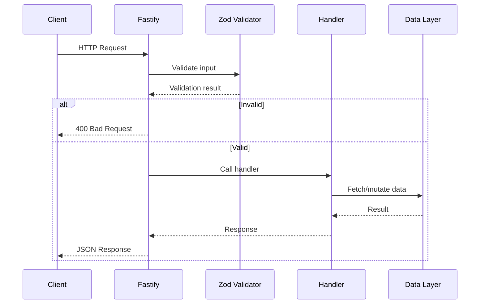

# API Server (`@even/api`)

The API Server is the backend application that provides REST endpoints for the EVEN platform.

## Technology Stack

| Layer | Technology | Version |
|-------|------------|---------|
| Framework | Fastify | 5.2.x |
| Validation | Zod | 3.24.x |
| CORS | @fastify/cors | 10.x |

## Directory Structure

```
apps/api/
├── src/
│   ├── index.ts       # Server entry point
│   ├── routes/        # Route handlers
│   │   ├── artist.ts
│   │   ├── products.ts
│   │   ├── earnings.ts
│   │   └── fans.ts
│   ├── data/          # Mock data generators
│   └── lib/           # Utilities
└── package.json
```

## API Endpoints

| Method | Path | Description |
|--------|------|-------------|
| GET | `/health` | Health check |
| GET | `/artist` | Get artist profile |
| GET | `/products` | List products with filters |
| GET | `/earnings` | Get earnings data |
| GET | `/fans` | Get fan engagement metrics |

See the [API Reference](/api) for complete documentation.

## Request/Response Flow



## Validation

All inputs are validated using Zod schemas from `@even/shared`:

```typescript
import { ProductsResponseSchema } from '@even/shared';

// Response is automatically typed and validated
const response = ProductsResponseSchema.parse(data);
```

## Error Handling

Errors follow a consistent format:

```json
{
  "error": "Not Found",
  "message": "Product with ID abc123 not found",
  "statusCode": 404,
  "requestId": "req-12345"
}
```

## Configuration

| Variable | Description | Default |
|----------|-------------|---------|
| `PORT` | Server port | `4000` |
| `HOST` | Server host | `localhost` |
| `CORS_ORIGIN` | Allowed origins | `http://localhost:3000` |

## Dependencies

- `@even/shared` - Type definitions and schemas

## Related

- [Web App](/architecture/components/web-app) - Frontend consumer
- [API Reference](/api) - Complete endpoint documentation
- [Data Flows](/architecture/data-flow) - Request lifecycle
