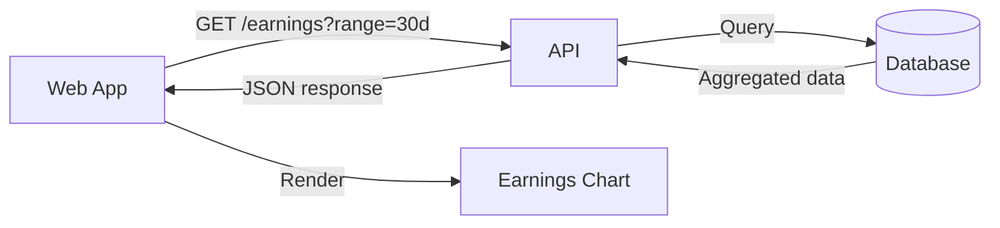
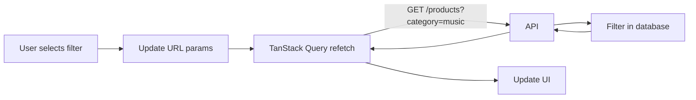
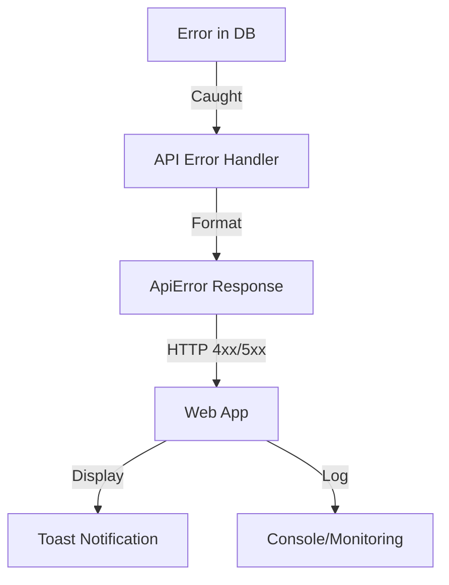

import { DiagramViewer } from '@/components/DiagramViewer'

# Data Flow

This section documents how data flows through the EVEN platform for key operations.

## Product Creation Flow

The following sequence diagram shows how an artist creates a new product:

<DiagramViewer
  diagram={`sequenceDiagram
    autonumber
    participant A as Artist
    participant W as Web App
    participant API as API Server
    participant DB as Database
    participant CDN as Media CDN

    A->>W: Navigate to Products
    W->>API: GET /products
    API->>DB: Query artist products
    DB-->>API: Product list
    API-->>W: Products JSON
    W-->>A: Display product grid

    A->>W: Click "Add Product"
    W-->>A: Show product form

    A->>W: Fill form + Upload media
    W->>CDN: Upload media files
    CDN-->>W: Media URLs

    A->>W: Submit product
    W->>API: POST /products
    API->>DB: Validate & Save
    DB-->>API: Product created
    API-->>W: Success response
    W-->>A: Show success + Redirect

    Note over A,CDN: Product now available for fans to purchase`}
  title="Product Creation Flow"
/>

## Key Data Flows

### Dashboard Load

When an artist opens the dashboard:

1. Web App requests artist profile from API
2. API fetches data from database
3. Dashboard displays KPIs, charts, and recent activity

### Earnings Data



### Product Filtering



## Data Validation

Data is validated at multiple points:

| Point | Mechanism | Purpose |
|-------|-----------|---------|
| Frontend | Zod schemas | Form validation |
| API | Zod schemas | Input validation |
| Database | Schema constraints | Data integrity |

### Example: Product Validation

```typescript
// Shared schema used by both frontend and backend
const ProductSchema = z.object({
  title: z.string().min(1).max(100),
  category: z.enum(['music', 'video', 'merch', 'experience']),
  price: z.number().min(0),
  description: z.string().max(1000).optional(),
});

// Frontend: Form validation
const result = ProductSchema.safeParse(formData);
if (!result.success) {
  showErrors(result.error);
}

// Backend: Request validation
const validated = ProductSchema.parse(req.body);
```

## Caching Strategy

| Data Type | Cache TTL | Invalidation |
|-----------|-----------|--------------|
| Artist Profile | 5 min | On update |
| Products | 1 min | On create/update/delete |
| Earnings | 5 min | Time-based |
| Fans | 5 min | Time-based |

TanStack Query handles caching automatically:

```typescript
useQuery({
  queryKey: ['products', filters],
  queryFn: fetchProducts,
  staleTime: 60 * 1000, // 1 minute
});
```

## Error Handling

Errors propagate through the stack:



## Related

- [API Server](/architecture/components/api) - Backend implementation
- [Web App](/architecture/components/web-app) - Frontend implementation
- [API Reference](/api) - Endpoint details
