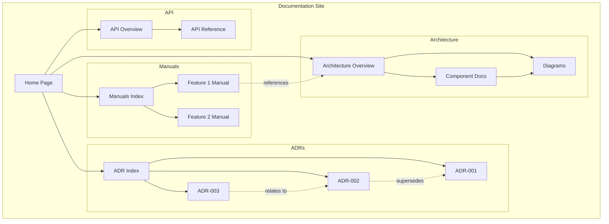
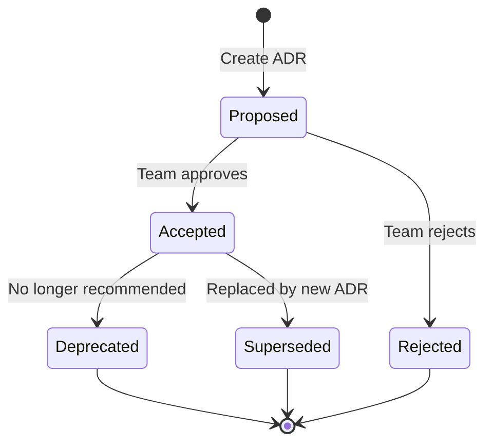
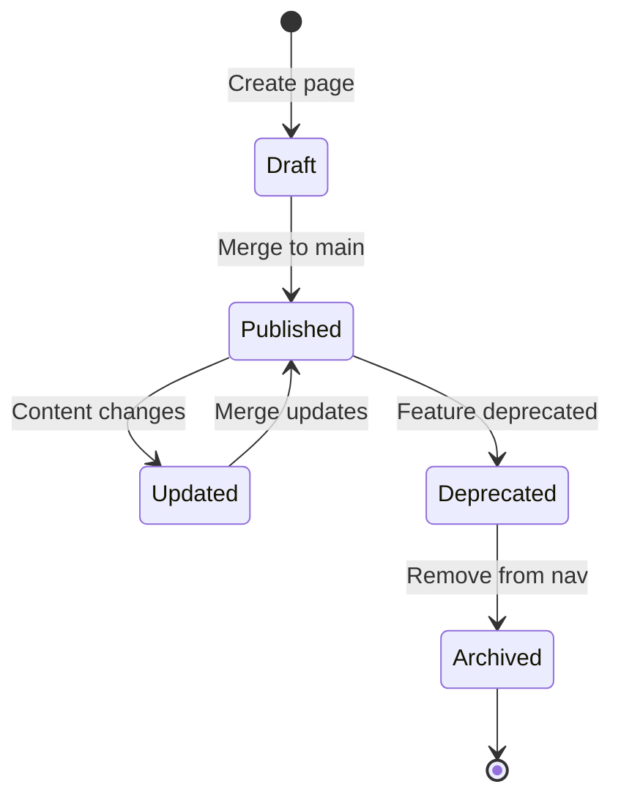

# Data Model: Architecture Documentation Suite

**Feature**: 006-architecture-documentation
**Date**: 2026-02-05

## Overview

This feature is primarily content-driven with file-based storage. The "data model" represents the structure of documentation content rather than database entities.

## Content Entities

### 1. Documentation Page

A single unit of documentation content stored as MDX.

```typescript
// Frontmatter schema (validated at build time)
interface DocumentationPage {
  // Required
  title: string;                    // Page title displayed in nav and header
  description: string;              // SEO and preview description

  // Optional
  category: 'architecture' | 'adr' | 'manual' | 'api';
  version?: string;                 // e.g., "1.0", "2.0" for versioned docs
  lastUpdated?: string;             // ISO date, auto-populated by Git
  author?: string;                  // Primary author
  tags?: string[];                  // Searchable tags
  sidebar_position?: number;        // Order in navigation
  deprecated?: boolean;             // Visual indicator for outdated content
  deprecation_notice?: string;      // Explanation and link to replacement
}
```

**File Location**: `apps/docs/src/pages/**/*.mdx`
**Naming Convention**: `kebab-case.mdx`

### 2. Architecture Diagram

A visual representation stored as Mermaid source.

```typescript
interface ArchitectureDiagram {
  // File metadata (derived from path/frontmatter)
  id: string;                       // Unique ID (filename without extension)
  title: string;                    // Human-readable title
  type: 'c4-context' | 'c4-container' | 'c4-component' |
        'sequence' | 'flowchart' | 'er' | 'state';

  // Content
  source: string;                   // Mermaid syntax

  // Navigation
  linkedPages?: string[];           // Pages that reference this diagram
  clickableNodes?: {                // Node-to-page mapping for drill-down
    nodeId: string;
    targetPage: string;
  }[];
}
```

**File Location**: `packages/docs-content/diagrams/**/*.mmd`
**Naming Convention**: `diagram-type-name.mmd` (e.g., `c4-system-context.mmd`)

### 3. Architecture Decision Record (ADR)

Structured decision documentation following MADR format.

```typescript
interface ADR {
  // Required frontmatter
  number: number;                   // Sequential ID (e.g., 1, 2, 3)
  title: string;                    // Decision title
  status: 'proposed' | 'accepted' | 'deprecated' | 'superseded';
  date: string;                     // ISO date of decision
  decisionMakers: string[];         // People involved in decision

  // Content sections (in MDX body)
  context: string;                  // Problem description
  decision: string;                 // What was decided
  consequences: {
    positive: string[];
    negative: string[];
  };
  alternatives?: {
    name: string;
    description: string;
    rejectedBecause: string;
  }[];

  // Relationships
  supersededBy?: number;            // ADR number that replaces this
  supersedes?: number;              // ADR number this replaces
  relatedDecisions?: number[];      // Related ADR numbers

  // Metadata
  tags?: string[];
}
```

**File Location**: `apps/docs/src/pages/adr/NNN-title.mdx`
**Naming Convention**: `NNN-kebab-case-title.mdx` (e.g., `001-use-mermaid-for-diagrams.mdx`)

### 4. User Manual

Task-oriented documentation for end users.

```typescript
interface UserManual {
  // Frontmatter
  title: string;
  description: string;
  feature: string;                  // Feature area this documents
  difficulty: 'beginner' | 'intermediate' | 'advanced';
  estimatedTime?: string;           // e.g., "5 minutes"
  prerequisites?: string[];         // Links to prerequisite pages

  // Content structure (in MDX body)
  steps: {
    number: number;
    instruction: string;
    screenshot?: string;            // Path to annotated image
    tip?: string;                   // Optional helpful tip
    warning?: string;               // Optional caution
  }[];

  // Troubleshooting
  commonIssues?: {
    problem: string;
    solution: string;
  }[];
}
```

**File Location**: `apps/docs/src/pages/manuals/[feature]/*.mdx`
**Naming Convention**: `action-noun.mdx` (e.g., `add-new-product.mdx`)

### 5. API Endpoint Documentation

Generated from OpenAPI spec with manual enhancements.

```typescript
interface APIEndpoint {
  // From OpenAPI spec
  path: string;                     // e.g., "/api/products"
  method: 'GET' | 'POST' | 'PUT' | 'DELETE' | 'PATCH';
  operationId: string;
  summary: string;
  description: string;

  // Request
  parameters?: {
    name: string;
    in: 'query' | 'path' | 'header';
    required: boolean;
    schema: JSONSchema;
    description: string;
  }[];
  requestBody?: {
    contentType: string;
    schema: JSONSchema;
    example: unknown;
  };

  // Response
  responses: {
    statusCode: number;
    description: string;
    schema?: JSONSchema;
    example?: unknown;
  }[];

  // Enhanced documentation (manual additions)
  useCases?: string[];              // When to use this endpoint
  relatedEndpoints?: string[];      // Links to related endpoints
}
```

**File Location**: Generated from `apps/api` OpenAPI spec, rendered via Scalar component
**Manual Enhancements**: `apps/docs/src/pages/api/endpoints/*.mdx`

## Content Relationships



## Validation Rules

### Documentation Pages
- `title` required, max 100 characters
- `description` required, max 200 characters (for SEO)
- `category` must be valid enum value
- `tags` max 10 tags, each max 30 characters

### ADRs
- `number` must be unique and sequential
- `status` required, valid enum
- If `status === 'superseded'`, `supersededBy` required
- `date` must be valid ISO date

### Diagrams
- File must contain valid Mermaid syntax (validated at build)
- `type` must match Mermaid diagram type in source
- Referenced nodes in `clickableNodes` must exist in diagram

### User Manuals
- `steps` must have sequential numbers starting from 1
- `screenshot` paths must resolve to existing files
- `prerequisites` links must resolve to valid pages

## State Transitions

### ADR Lifecycle



### Documentation Page Lifecycle



## Search Index Structure

The search index is built at compile time from all MDX frontmatter and content.

```typescript
interface SearchIndex {
  pages: {
    id: string;           // Page path
    title: string;
    description: string;
    category: string;
    tags: string[];
    content: string;      // Stripped markdown text
    headings: string[];   // H2/H3 headings for section search
  }[];
}
```

**Index Location**: Generated at build time, embedded in client bundle
**Search Algorithm**: FlexSearch with fuzzy matching
