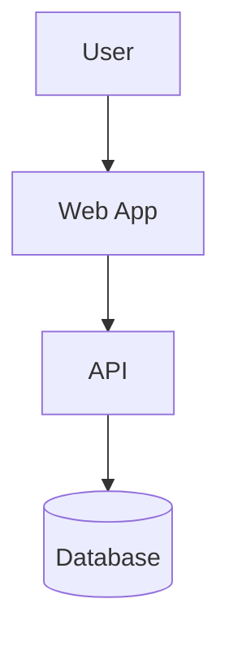

# Quickstart: Architecture Documentation Suite

**Feature**: 006-architecture-documentation
**Date**: 2026-02-05

## Prerequisites

- Bun 1.1.42+ installed
- Repository cloned and dependencies installed (`bun install`)
- Familiarity with MDX and Markdown

## Quick Setup (5 minutes)

### 1. Install Documentation App Dependencies

```bash
# From repository root
cd apps/docs
bun install
```

### 2. Start Documentation Dev Server

```bash
# From apps/docs
bun run dev

# Or from root with Turborepo
bun run dev --filter=@even/docs
```

Documentation will be available at **http://localhost:3001**

### 3. Create Your First Documentation Page

Create a new MDX file in `apps/docs/src/pages/`:

```bash
# Example: Create architecture overview
touch apps/docs/src/pages/architecture/overview.mdx
```

Add frontmatter and content:

```mdx
---
title: "Architecture Overview"
description: "High-level system architecture for EVEN Artist Dashboard"
category: "architecture"
tags: ["architecture", "overview", "c4"]
---

# Architecture Overview

Welcome to the EVEN Artist Dashboard architecture documentation.

## System Context

The following diagram shows the system context:

<DiagramViewer src="/diagrams/architecture/system-context.mmd" />
```

## Key Tasks

### Adding a New Architecture Diagram

1. Create Mermaid source file:

```bash
touch packages/docs-content/diagrams/architecture/my-diagram.mmd
```

2. Add Mermaid syntax:



3. Reference in MDX:

```mdx
<DiagramViewer src="/diagrams/architecture/my-diagram.mmd" />
```

### Creating a New ADR

1. Determine the next ADR number:

```bash
ls apps/docs/src/pages/adr/*.mdx | wc -l
# Add 1 to get next number
```

2. Create ADR file:

```bash
touch apps/docs/src/pages/adr/005-my-decision.mdx
```

3. Use the template from `specs/006-architecture-documentation/contracts/adr-template.md`

4. Fill in all required sections

### Writing User Manual Content

1. Create feature directory if needed:

```bash
mkdir -p apps/docs/src/pages/manuals/products
```

2. Create manual page:

```bash
touch apps/docs/src/pages/manuals/products/add-new-product.mdx
```

3. Structure with steps:

```mdx
---
title: "Adding a New Product"
description: "Step-by-step guide to adding products to your catalog"
feature: "products"
difficulty: "beginner"
estimatedTime: "5 minutes"
---

# Adding a New Product

## Prerequisites

- Active artist account
- At least one product image

## Steps

### Step 1: Navigate to Products

Go to the Products section in the sidebar.


### Step 2: Click "Add Product"

...
```

## Directory Structure Reference

```
apps/docs/
├── src/
│   ├── pages/              # All documentation content
│   │   ├── index.mdx       # Home page
│   │   ├── architecture/   # Architecture docs
│   │   ├── adr/            # ADR collection
│   │   ├── manuals/        # User manuals
│   │   └── api/            # API documentation
│   ├── components/         # Custom React components
│   └── lib/                # Utilities
├── public/
│   └── images/             # Static images
├── package.json
├── next.config.mjs
└── theme.config.tsx

packages/docs-content/
├── diagrams/               # Mermaid source files
│   ├── architecture/
│   ├── sequences/
│   └── data-flows/
└── images/
    └── manuals/            # Manual screenshots
```

## Common Commands

| Command | Description |
|---------|-------------|
| `bun run dev` | Start docs dev server |
| `bun run build` | Build production docs |
| `bun run lint` | Lint MDX content |
| `bun run check-links` | Validate internal links |

## Tips

1. **Use relative links** between documentation pages for proper navigation
2. **Add tags** to frontmatter for better search discoverability
3. **Include alt text** for all images for accessibility
4. **Test diagrams** in the dev server before committing
5. **Follow ADR numbering** sequentially to maintain order

## Troubleshooting

### Diagram not rendering

- Check Mermaid syntax at https://mermaid.live
- Ensure file has `.mmd` extension
- Verify path in `src` prop matches actual file location

### Page not appearing in navigation

- Check frontmatter is valid YAML
- Ensure `sidebarPosition` is set if ordering matters
- Clear `.next` cache: `rm -rf apps/docs/.next`

### Search not finding content

- Rebuild the site: `bun run build`
- Check that content is not in `draft` status
- Verify tags are spelled correctly

## Next Steps

1. Review existing documentation structure
2. Read the [contribution guidelines](./contributing.mdx)
3. Browse example ADRs for format reference
4. Check the [style guide](./style-guide.mdx) for writing conventions
